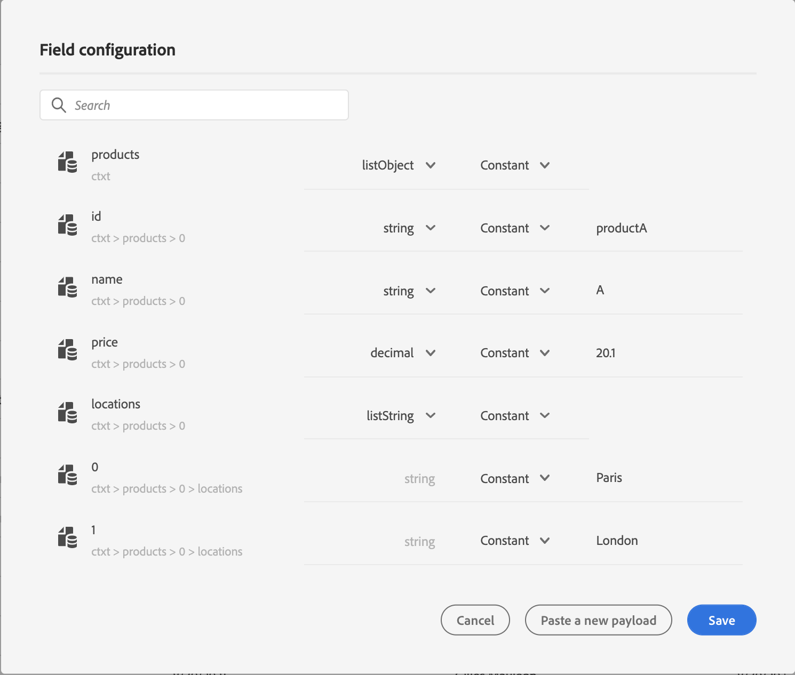

# Envie coleções dinamicamente usando ações personalizadas{#passing-collection}

Você pode passar uma coleção em parâmetros de ação personalizados que serão preenchidos dinamicamente no tempo de execução. Há suporte para dois tipos de coleções:

* coleções simples: arrays de tipos de dados simples, por exemplo, com uma listString:

   ```
   {
    "deviceTypes": [
        "android",
        "ios"
    ]
   }
   ```

* coleções de objetos: uma matriz de objetos JSON, por exemplo:

   ```
   {
   "products":[
      {
         "id":"productA",
         "name":"A",
         "price":20.1
      },
      {
         "id":"productB",
         "name":"B",
         "price":10.0
      },
      {
         "id":"productC",
         "name":"C",
         "price":5.99
      }
    ]
   }
   ```

## Limitações {#limitations}

* Matrizes de objetos que contêm subobjetos não são compatíveis. Por exemplo:

   ```
   {
   "products":[
     {
        "id":"productA",
        "name":"A",
        "details": {
        "color":"blue"
        },
        "price":20.0
     }
    ]
   }
   ```

* Matrizes aninhadas de objetos em uma matriz de objetos não são compatíveis no momento. Por exemplo:

   ```
   {
   "products":[
     {
        "id":"productA",
        "name":"A",
        "price":20,
        "locations": [{"name": "Paris"}, {"name": "London"}]
     },
    ]
   }
   ```
* Para testar coleções usando o modo de teste, é necessário usar o modo de visualização de código. O modo de visualização de código não é compatível com eventos comerciais no momento. Você só pode enviar uma coleção com um único elemento.

## Procedimento geral {#general-procedure}

Nesta seção, usaremos o seguinte exemplo de carga JSON. Esta é uma matriz de objetos com um campo que é uma coleção simples.

```
{
  "ctxt": {
    "products": [
      {
        "id": "productA",
        "name": "A",
        "price": 20.1,
        "color":"blue",
        "locations": [
          "Paris",
          "London"
        ]
      },
      {
        "id": "productB",
        "name": "B",
        "price": 10.99
      }
    ]
  }
}
```

Você pode ver que &quot;produtos&quot; é uma matriz de dois objetos. Você precisa ter pelo menos um objeto.

1. Crie sua ação personalizada. Consulte [esta página](../action/about-custom-action-configuration.md).

1. Na seção **[!UICONTROL Action parameters]**, cole o exemplo JSON. A estrutura exibida é estática: ao colar a carga útil, todos os campos são definidos como constantes.

   

1. Se necessário, ajuste os tipos de campo. Os seguintes tipos de campo são suportados para coleções: listString, listInteger, listDecimal, listBoolean, listDateTime, listDateTimeOnly, listDateOnly, listObjectListObject

   >[!NOTE]
   >
   >O tipo de campo é automaticamente inferido de acordo com o exemplo de carga útil.

1. Se você deseja transmitir objetos dinamicamente, é necessário defini-los como variáveis. Neste exemplo, definimos &quot;produtos&quot; como variável. Todos os campos de objeto incluídos no objeto são definidos como variáveis automaticamente.

   >[!NOTE]
   >
   >O primeiro objeto do exemplo de carga útil é usado para definir os campos.

1. Para cada campo, defina o rótulo que será exibido na tela de jornada.

   

1. Crie sua jornada e adicione a ação personalizada criada. Consulte [esta página](../building-journeys/using-custom-actions.md).

1. Na seção **[!UICONTROL Action parameters]** , defina o parâmetro de matriz (&quot;products&quot; em nosso exemplo) usando o editor de expressão avançado.

   

1. Para cada um dos seguintes campos de objeto, digite o nome do campo correspondente do esquema XDM de origem. Se os nomes forem idênticos, isso não será necessário. No nosso exemplo, só precisamos definir &quot;id do produto&quot; e &quot;cor&quot;.

   

No campo da matriz, também é possível usar o editor de expressão avançado para executar a manipulação de dados. No exemplo a seguir, usamos as funções [filter](https://git.corp.adobe.com/AdobeDocs/journeys.en/blob/fvi-21.9/help/using/functions/functionfilter.md) e [intersett](https://git.corp.adobe.com/AdobeDocs/journeys.en/blob/fvi-21.9/help/using/functions/functiontintersect.md):


## Casos particulares{#examples}

Para tipos heterogêneos e matrizes de matrizes, a matriz é definida com o tipo listAny . Você só pode mapear itens individuais, mas não pode alterar a matriz para a variável.


Exemplo de tipo heterogêneo:

```
{
    "data_mixed-types": [
        "test",
        "test2",
        null,
        0
    ]
}
```

Exemplo de matriz de arrays:

```
{
    "data_multiple-arrays": [
        [
            "test",
            "test1",
            "test2"
        ]
    ]
}
```

**Tópicos relacionados**

[Usar ações personalizadas](../building-journeys/using-custom-actions.md)