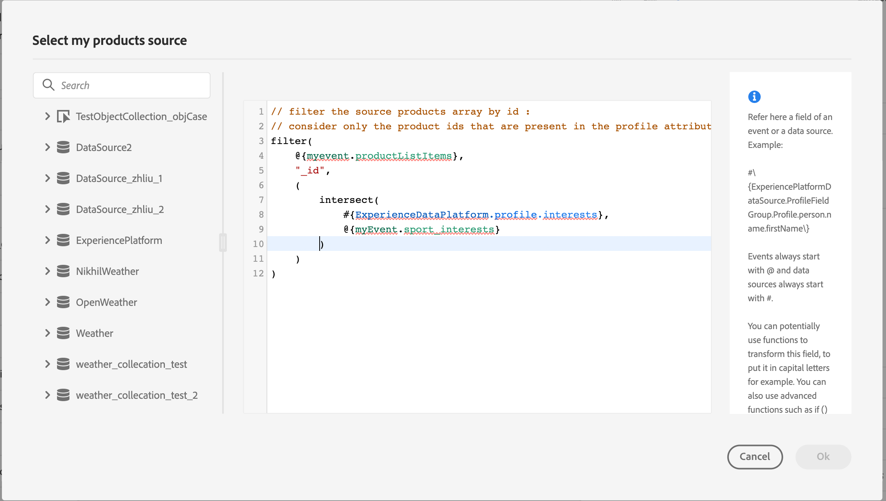

# Envie coleções dinamicamente usando ações personalizadas{#passing-collection}

You can pass a collection in custom action parameters that will be dynamically populated at runtime. Há suporte para dois tipos de coleções:

* coleções simples: arrays de tipos de dados simples, por exemplo, com uma listString:

   ```
   {
    "deviceTypes": [
        "android",
        "ios"
    ]
   }
   ```

* coleções de objetos: uma matriz de objetos JSON, por exemplo:

   ```
   {
   "products":[
      {
         "id":"productA",
         "name":"A",
         "price":20.1
      },
      {
         "id":"productB",
         "name":"B",
         "price":10.0
      },
      {
         "id":"productC",
         "name":"C",
         "price":5.99
      }
    ]
   }
   ```

## Limitações {#limitations}

* Matrizes aninhadas de objetos em uma matriz de objetos não são compatíveis no momento. Por exemplo:

   ```
   {
   "products":[
     {
        "id":"productA",
        "name":"A",
        "price":20,
        "locations": [{"name": "Paris"}, {"name": "London"}]
     },
    ]
   }
   ```
* Para testar coleções usando o modo de teste, é necessário usar o modo de visualização de código. O modo de visualização de código não é compatível com eventos comerciais no momento. You can only send a collection with a single element.

## Procedimento geral {#general-procedure}

Nesta seção, usaremos o seguinte exemplo de carga JSON. Esta é uma matriz de objetos com um campo que é uma coleção simples.

```
{
  "ctxt": {
    "products": [
      {
        "id": "productA",
        "name": "A",
        "price": 20.1,
        "color":"blue",
        "locations": [
          "Paris",
          "London"
        ]
      },
      {
        "id": "productB",
        "name": "B",
        "price": 10.99
      }
    ]
  }
}
```

You can see that &quot;products&quot; is an array of two objects. Você precisa ter pelo menos um objeto.

1. Crie sua ação personalizada. Consulte [esta página](../action/about-custom-action-configuration.md).

1. In the **[!UICONTROL Action parameters]** section, paste the JSON example. The displayed structure is static: when pasting the payload, all fields are defined as constants.

   

1. Se necessário, ajuste os tipos de campo. The following field types are supported for collections: listString, listInteger, listDecimal, listBoolean, listDateTime, listDateTimeOnly, listDateOnly, listObject

   >[!NOTE]
   >
   >The field type is automatically inferred according to the payload example.

1. If you want to pass objects dynamically, you need to set them as variables. In this example we set &quot;products&quot; as variable. Todos os campos de objeto incluídos no objeto são definidos como variáveis automaticamente.

   >[!NOTE]
   >
   >O primeiro objeto do exemplo de carga útil é usado para definir os campos.

1. Para cada campo, defina o rótulo que será exibido na tela de jornada.

   

1. Crie sua jornada e adicione a ação personalizada criada. Consulte [esta página](../building-journeys/using-custom-actions.md).

1. No **[!UICONTROL Action parameters]** , defina o parâmetro de matriz (&quot;products&quot; no nosso exemplo) usando o editor de expressão avançado.

   

1. Para cada um dos seguintes campos de objeto, digite o nome do campo correspondente do esquema XDM de origem. Se os nomes forem idênticos, isso não será necessário. No nosso exemplo, só precisamos definir &quot;id do produto&quot; e &quot;cor&quot;.

   

No campo da matriz, também é possível usar o editor de expressão avançado para executar a manipulação de dados. No exemplo a seguir, usamos o [filter](../functions/functionfilter.md) e [interseção](../functions/functionintersect.md) funções:



## Casos particulares{#examples}

For heterogeneous types and arrays of arrays, the array is defined with the listAny type. Você só pode mapear itens individuais, mas não pode alterar a matriz para a variável.


Exemplo de tipo heterogêneo:

```
{
    "data_mixed-types": [
        "test",
        "test2",
        null,
        0
    ]
}
```

Exemplo de matriz de arrays:

```
{
    "data_multiple-arrays": [
        [
            "test",
            "test1",
            "test2"
        ]
    ]
}
```

**Tópicos relacionados**

[Use custom actions](../building-journeys/using-custom-actions.md)
