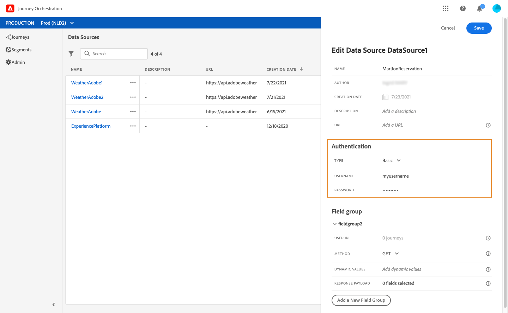

# Configuração das fontes de dados {#concept_vml_hdy_w2b}

Em nosso caso de uso, queremos usar dados de personalização para nossas mensagens. Também precisamos verificar se a pessoa é um membro da fidelidade e não foi contatada nas últimas 24 horas. Essas informações são armazenadas no banco de dados de Perfil do cliente em tempo real. O usuário **** técnico precisa configurar a fonte de dados da Plataforma de experiência para recuperar esses campos.

Para obter informações adicionais sobre a configuração da fonte de dados, consulte [](../datasource/about-data-sources.md).

1. No menu superior, clique na **[!UICONTROL Data Sources]**guia e selecione a fonte de dados integrada da Experience Platform.

   

1. Nos campos de grupo pré-configurados, verifique se os seguintes campos estão selecionados:

   * _pessoa > nome > nome_
   * _pessoa > nome > sobrenome_
   * _personalEmail > endereço_

1. Clique em **[!UICONTROL Add a New Field Group]**, selecione um**[!UICONTROL Profiles]** esquema e adicione o campo membro **** Fidelidade para nossa condição. O campo do membro **** Fidelidade é um campo personalizado e foi adicionado no XDM: &quot;_customer > marlton > leyaltyMember&quot;

   

1. Clique em **[!UICONTROL Add a New Field Group]**, selecione um**[!UICONTROL ExperienceEvent]** esquema e escolha os campos necessários para nossa condição quanto ao número de mensagens enviadas em um determinado período: carimbo de _data e hora_ para a data e _directMarketing > envia > valor_ para o número de mensagens enviadas.

   

1. Clique em **[!UICONTROL Save]**.

Também precisamos verificar se a pessoa tem uma reserva no sistema de reservas do hotel. O usuário **** técnico precisa configurar uma segunda fonte de dados para recuperar esse campo.

1. Na lista de fontes de dados, clique em **[!UICONTROL Add]**para adicionar uma nova fonte externa de dados para definir a conexão com o sistema de reservas do hotel.

   

1. Digite um nome para a fonte de dados e o URL do serviço externo, por exemplo: _https://marlton.com/reservation_

   >[!CAUTION]
   >
   >Recomendamos o uso do HTTPS por motivos de segurança.

1. Configure a autenticação dependendo da configuração do serviço externo: **[!UICONTROL No authentication]**,**[!UICONTROL Basic]**, **[!UICONTROL Custom]**ou**[!UICONTROL API key]**. Em nosso exemplo, escolhemos &quot;Básico&quot; para o tipo e especificamos o nome de usuário e a senha para a chamada da API.

   

1. Clique em **[!UICONTROL Add a New Field Group]**para definir as informações a serem recuperadas e os parâmetros da API. Para nosso exemplo, há apenas um parâmetro (a id), portanto, precisamos criar um grupo de campos com as seguintes informações:

   * **[!UICONTROL Method]**: selecione o método POST ou GET. No nosso caso, selecionamos o método GET.
   * **[!UICONTROL Cache duration]**: isso varia de acordo com a frequência das chamadas da API. Em nosso caso, o sistema de reservas é atualizado a cada 10 minutos.
   * **[!UICONTROL Response Payload]**: clique dentro do**[!UICONTROL Payload]** campo e cole um exemplo da carga. Verifique se os tipos de campo estão corretos. Cada vez que a API é chamada, o sistema recuperará todos os campos incluídos no exemplo de carga. Em nosso exemplo, a carga contém apenas o status da reserva:

   ```
   {
       "reservation" : true
   }
   ```

   * **[!UICONTROL Dynamic Values]**: insira o parâmetro correspondente à chave usada para identificar cada cliente, &quot;id&quot; no nosso exemplo. O valor desse parâmetro será definido na jornada.
   

1. Clique em **[!UICONTROL Save]**.

   As fontes de dados agora estão configuradas e prontas para serem usadas em sua jornada.
