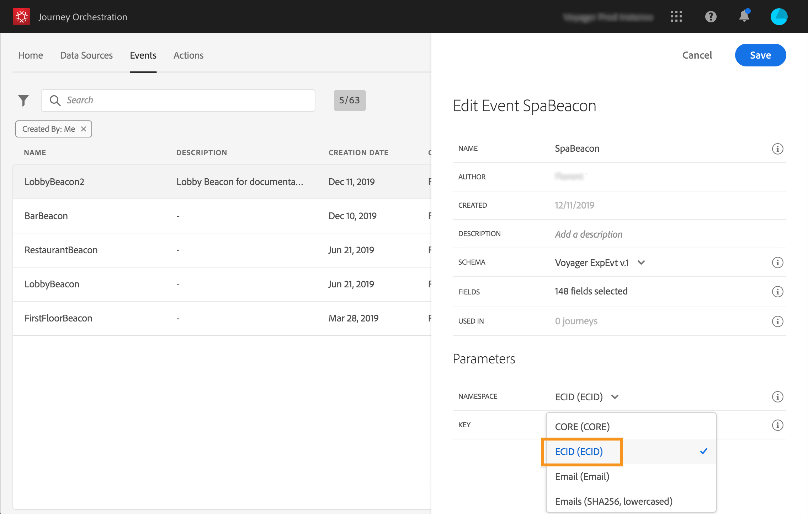

# Configuração do evento{#concept_y44_hcy_w2b}

Em nosso cenário, precisamos receber um evento sempre que uma pessoa caminhar perto de um beacon posicionado ao lado do spa. O **usuário técnico** precisa configurar o evento que o sistema ouvirá em nossa jornada.

Para obter informações adicionais sobre a configuração do evento, consulte [esta página](../event/about-events.md).

1. No menu superior, clique na guia **[!UICONTROL Events]** e clique em **[!UICONTROL Add]** para criar um novo evento.

   

1. Inserimos o nome sem espaços ou caracteres especiais: &quot;SpaBeacon&quot;.

   

1. Em seguida, selecionamos o schema e definimos a carga útil esperada para esse evento. Selecionamos os campos necessários do modelo normalizado XDM. Precisamos da ID de Experience Cloud para identificar a pessoa no banco de dados de Perfil do cliente em tempo real: _endUserIDs > experiência > mcid > id_. Uma ID é gerada automaticamente para esse evento. Esta ID está armazenada no campo **[!UICONTROL eventID]** (_experiência > campanha > orquestração > eventID_). O sistema que envia o evento não deve gerar uma ID, mas usar a disponível na pré-visualização de carga. No nosso caso de uso, essa ID é usada para identificar a localização do beacon. Cada vez que uma pessoa se aproxima do sinal de spa, um evento será enviado contendo essa ID de evento específica. Isso permite que o sistema saiba qual beacon acionou o envio do evento.

   

   >[!NOTE]
   >
   >A lista de campos varia de um esquema para outro. De acordo com a definição do esquema, alguns campos podem ser obrigatórios e pré-selecionados.

1. Precisamos selecionar um namespace. Um namespace é pré-selecionado com base nas propriedades do schema. Você pode manter o que está pré-selecionado. Para obter mais informações sobre namespaces, consulte [esta página](../event/selecting-the-namespace.md).

   

1. Uma chave é pré-selecionada com base nas propriedades do schema e no namespace selecionado. Você pode ficar com ele.

   

1. Clique em **[!UICONTROL Save]**.

1. Clique no ícone **[!UICONTROL View Payload]** para visualizar o conteúdo esperado pelo sistema e compartilhá-lo com a pessoa responsável pelo envio do evento. Essa carga precisará ser configurada no postback do console de administração do Mobile Services.

   

   O evento está pronto para ser usado na jornada. Agora é necessário configurar o aplicativo móvel para que ele possa enviar o conteúdo esperado para o endpoint das APIs de assimilação de streaming. Consulte [esta página](../event/additional-steps-to-send-events-to-journey-orchestration.md).
