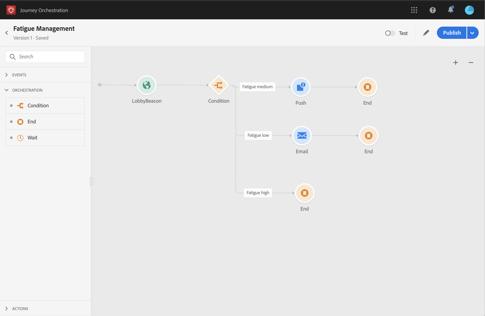

# Alavancando pontuações de fadiga {#concept_dsh_1ry_wfb}

Este caso de uso mostrará como aproveitar as pontuações de fadiga para evitar a solicitação excessiva de seus clientes em suas viagens.

>[!CAUTION]
>
>O recurso de pontuação de fadiga preditiva só está disponível para clientes que usam o recurso Adobe Campaign Standard Data Service.

## Configuração do evento {#section_ptb_ws1_ffb}

Siga as etapas descritas em [](../event/about-events.md).

## Configuração da fonte de dados {#section_o3n_4yy_wfb}

Execute as seguintes etapas para selecionar os campos de pontuação de fadiga na fonte de dados incorporada:

1. No menu superior, clique na **[!UICONTROL Data Sources]**guia e selecione a fonte de dados integrada da Experience Platform.

   

1. Verifique se os campos necessários para o caso de uso estão selecionados.
1. Clique **[!UICONTROL Add a New Field Group]**, selecione o**[!UICONTROL Profiles]** modelo e adicione os campos **[!UICONTROL fatigueLevel]**e**[!UICONTROL fatigueScore]** (em _jornadaAI > e-mailScore > fadiga_).

   

1. Clique em **[!UICONTROL Save]**.

## Construção da viagem {#section_uzm_pyy_wfb}

Para criar, validar e publicar a jornada, siga as etapas descritas em [](../building-journeys/journey.md).

Em nosso caso de uso, estamos alavancando o **[!UICONTROL fatigueLevel]**campo. Você também pode usar o**[!UICONTROL fatigueScore]** campo.

Execute as seguintes etapas para alavancar o nível de fadiga em sua jornada:

1. Adicione um evento e uma condição em sua jornada.

   

1. Escolha o **[!UICONTROL Data Source Condition]**tipo e clique no**[!UICONTROL Expression]** campo.

   

1. Usando o editor de expressões simples, procure o **[!UICONTROL fatigueLevel]**campo (_ExperiencePlatformDataSource > JourneyAIScores > Perfil > jornadaAI > emailScore > fadiga_), solte-o para a direita e crie a seguinte condição: &quot;fadigaLevel é igual a &quot;Baixo&quot;. Clique em**[!UICONTROL Ok]**.

   

   A expressão avançada é:

   ```
   #{ExperiencePlatformDataSource.JourneyAIScores.Profile.journeyAI.emailScore.fatigue.fatigueLevel} == "low"
   ```

1. Na condição, crie outros dois caminhos para níveis de fadiga médios e altos.

   

1. Agora é possível adicionar diferentes ações para cada nível de fadiga.

   
