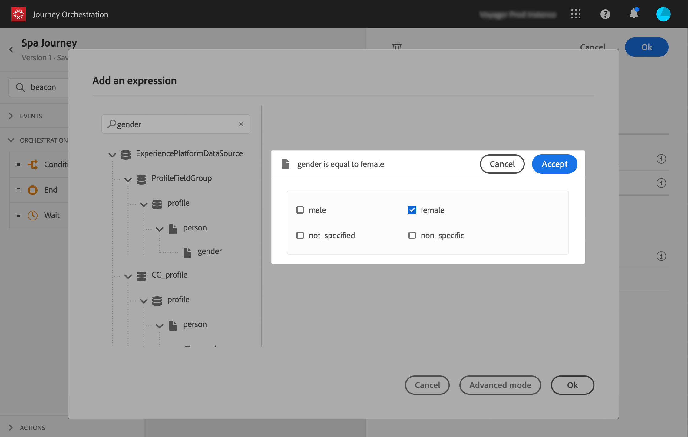

# Construir a jornada{#concept_eyw_mcy_w2b}

Agora o **usuário empresarial** pode criar a jornada. Nossa jornada incluirá apenas um caminho com as seguintes atividades:

* o &quot;SpaBeacon&quot; **[!UICONTROL Event]**: quando uma pessoa caminha perto do spa beacon, o sistema receberá um evento e a viagem será start para essa pessoa.
* uma **[!UICONTROL Condition]** atividade para verificar se a pessoa é uma mulher
* uma **[!UICONTROL Email]** atividade (usando o Adobe Campaign Standard)
* uma atividade **[!UICONTROL End]**

>[!NOTE]
>
>As atividades **[!UICONTROL Push]** e **[!UICONTROL Email]** só estarão disponíveis na paleta se você tiver o Adobe Campaign Standard.

Para obter informações adicionais sobre como criar uma jornada, consulte .

1. No menu superior, clique na guia **[!UICONTROL Home]** e **[!UICONTROL Create]** para criar uma nova jornada.

   

1. Edite as propriedades da jornada no painel de configuração exibido no lado direito. Nós o chamamos de &quot;Viagem Spa&quot; e a definimos para durar um mês, do 1º ao 31º de dezembro.

   

1. Start desenhando sua jornada arrastando e soltando o evento &quot;SpaBeacon&quot; da paleta para a tela. Você também pode dar um duplo clique no evento da paleta para adicioná-lo à tela.

   

1. Agora vamos adicionar uma condição para verificar se a pessoa é uma mulher. Arraste e solte uma atividade de condição na sua jornada.

   

1. Escolha o tipo **[!UICONTROL Data Source Condition]** e clique no campo **[!UICONTROL Expression]**. Você também pode definir um rótulo de condição que aparecerá na seta sobre a tela.

   

1. Usando o editor de expressões simples, procure o campo de gênero (_pessoa > gênero_) e solte-o à direita para criar a seguinte condição: &quot;O gênero é igual a &quot;Mulher&quot;.

   

1. Solte uma **[!UICONTROL Email]** atividade e selecione seu modelo de mensagem transacional de &quot;Desconto do Spa&quot;. Este modelo foi projetado usando o Adobe Campaign. Consulte esta [página](https://docs.adobe.com/content/help/pt-BR/campaign-standard/using/communication-channels/transactional-messaging/about-transactional-messaging.html).

   

1. Click inside the **[!UICONTROL Email]** field and select the email address from the data source.

   

1. Da mesma forma, defina os campos de personalização de nome e sobrenome da fonte de dados.

   

1. Solte uma **[!UICONTROL End]** atividade.

   

1. Clique na opção de **[!UICONTROL Test]** alternar e teste sua jornada usando perfis de teste. Se houver algum erro, desative o modo de teste, modifique sua jornada e teste novamente. Para obter mais informações sobre o modo de teste, consulte .

   

1. Quando o teste for conclusivo, você pode publicar sua jornada pelo menu suspenso no canto superior direito.

   

Na próxima vez que uma mulher caminhar perto do beacon spa, ela receberá imediatamente um e-mail personalizado com &quot;desconto spa&quot;.
