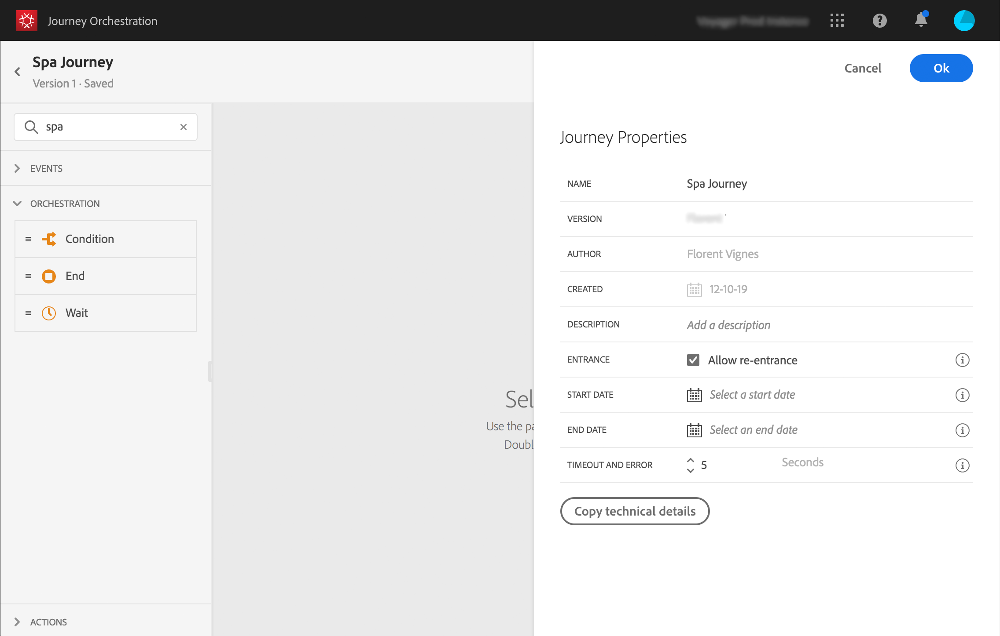
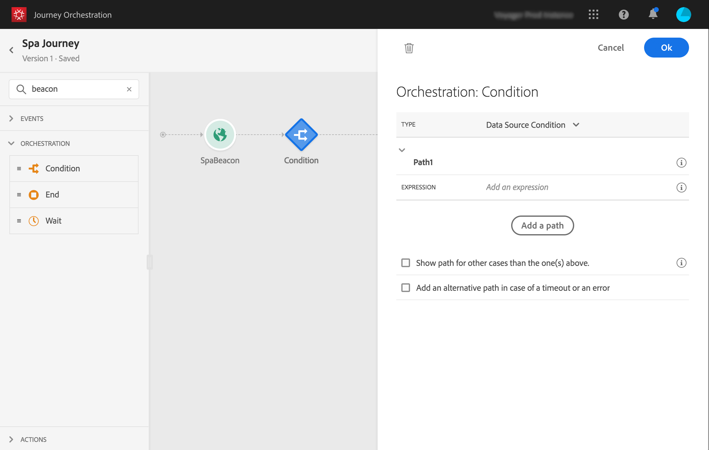

# Construção da jornada{#concept_eyw_mcy_w2b}

Agora o **usuário empresarial** pode criar a jornada. Nossa jornada incluirá apenas um caminho com as seguintes atividades:

* o &quot;SpaBeacon&quot; **[!UICONTROL Event]**: quando uma pessoa caminha perto do spa beacon, o sistema receberá um evento e a jornada começará para essa pessoa.
* a **[!UICONTROL Condition]** atividade para verificar se a pessoa é mulher
* um **[!UICONTROL Email]** atividade (usando o Adobe Campaign Standard)
* uma atividade **[!UICONTROL End]**

>[!NOTE]
>
>As atividades **[!UICONTROL Push]** e **[!UICONTROL Email]** só estarão disponíveis na paleta se você tiver o Adobe Campaign Standard.

Para obter mais informações sobre como criar uma jornada, consulte [esta página](../building-journeys/journey.md).

1. No menu superior, clique na guia **[!UICONTROL Home]** e **[!UICONTROL Create]** para criar uma nova jornada.

   

1. Edite as propriedades da jornada no painel de configuração exibido no lado direito. Chamamos de &quot;jornada do Spa&quot; e a definimos para durar um mês, de 1º a 31 de dezembro.

   

1. Inicie a criação da jornada arrastando e soltando o evento &quot;SpaBeacon&quot; da paleta para a tela. Você também pode dar um duplo clique no evento da paleta para adicioná-lo à tela.

   

1. Agora vamos adicionar uma condição para verificar se a pessoa é uma mulher. Arraste e solte uma atividade de condição na sua jornada.

   

1. Escolha o tipo **[!UICONTROL Data Source Condition]** e clique no campo **[!UICONTROL Expression]**. Você também pode definir um rótulo de condição que aparecerá na seta sobre a tela.

   

1. Usando o editor de expressão simples, procure o campo gênero (_pessoa > gênero_) e solte-a à direita para criar a seguinte condição: &quot;gênero é igual a &quot;Feminino&quot;.

   

1. Solte uma **[!UICONTROL Email]** e selecione o modelo de mensagens transacionais &quot;Desconto de spa&quot;. Esse modelo foi projetado usando o Adobe Campaign. Consulte esta [página](https://experienceleague.adobe.com/docs/campaign-standard/using/communication-channels/transactional-messaging/getting-started-with-transactional-msg.html?lang=pt-BR).

   

1. Clique dentro do **[!UICONTROL Email]** e selecione o endereço de email da fonte de dados.

   

1. Da mesma forma, defina os campos de personalização de nome e sobrenome a partir da fonte de dados.

   

1. Solte uma **[!UICONTROL End]** atividade .

   

1. Clique no botão **[!UICONTROL Test]** alterne e teste sua jornada usando perfis de teste. Se houver algum erro, desative o modo de teste, modifique sua jornada e teste novamente. Para obter mais informações sobre o modo de teste, consulte [esta página](../building-journeys/testing-the-journey.md).

   

1. Quando o teste for conclusivo, você pode publicar sua jornada pelo menu suspenso no canto superior direito.

   

Na próxima vez que uma mulher se aproximar do beacon spa, ela receberá imediatamente um email personalizado de &quot;desconto Spa&quot;.
